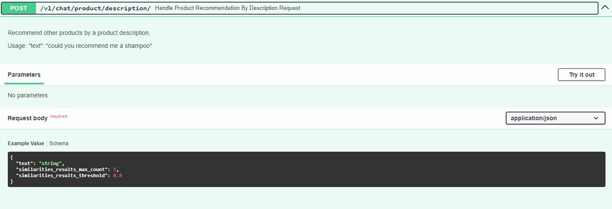

<div align="center">
  <h1>FastAPI product search using ChatGPT-4o mini and vector embeddings</h1>
  <br />
  <br />
</div>

<details open="open">
<summary>Table of Contents</summary>

- [About](#about)
  - [Built With](#built-with)
- [Usage](#usage)
    - [Manual setup](#manual-setup)
    - [System Design](#system-design)
    - [Environment variables](#environment-variables)
- [Screenshots](#screenshots)
- [License](#license)

</details>

---

## About

<table>
<tr>
<td>

This project is a backend system built with FastAPI, designed to enable product search using natural language queries. It offers endpoints for searching products by description and price. 
The solution integrates the ChatGPT-4.0 mini model for prompt engineering tasks, including categorizing user inputs, extracting product descriptions, and retrieving price details. 
Additionally, it utilizes the text-embedding-ada-002 model to generate semantic embeddings for more accurate and efficient product matching.

The searchable products are in a product_embeddings.csv file with pre-computed embeddings. These are stored in a pandas dataframe, in-memory.<br>
The embedding for each product includes:
* product title
* product description
* product vendor
* product type
* product tags

</td>
</tr>
</table>

### Built With

- BAML
- Python 3.12
- FastAPI
- OpenAI
- Pydantic
- Pandas
- Numpy
- Swagger

### Usage

#### Manual setup

Please follow these steps for manual setup:
1. Download this GitHub repository.
2. Create a virtual environment.

    ```
    python3 -m venv <myenvname>
    ```

3. Activate virtual environment.

    ```
    cd venv
    Scripts\Activate.ps1
    ```
    Or different Activate script, if you are not working from Visual Code.

4. Install packages from requirements.txt

    ```
    pip install -r /path/to/requirements.txt
    ```

5. Download [VS Code extension for BAML](https://marketplace.visualstudio.com/items?itemName=Boundary.baml-extension)

6. Go to any .baml file and click Save (CTRL + S). This will generate python code from .BAML.

7. If the baml_client got generated in the root directory, move it inside app/backend.

8. Inside baml_src > clients.baml, replace your api_key for GPT4oMini model.
   Also do this for the .env file's ```OPENAI_API_KEY``` key.

9. Run the app:

    ```
    python main.py
    ```

#### System Design

You can find System Design notes in the Product Search.pdf file.


#### Environment variables

in the .env file, replace these environment variables with your own values.

| Name                       | Default value      | Description                                                                 |
| -------------------------- | ------------------ | --------------------------------------------------------------------------- |
| OPENAI_API_KEY               |  | OpenAI API KEY                                                            |

## Screenshots

<br>
The main Swagger view.

## API Endpoints Overview
This section provides an overview of the available API endpoints for product recommendation and filtering.


<br>
The main endpoint for recommending products and filtering price.

<br>
The response from the main endpoint that both recommends products and can filter by price.

<br>
The second endpoint for recommending products by product description only.

<br>
The third endpoint for filtering products by the price only.

<br>
The response from the third endpoint that filters products by the price only.

<br>
The example of how a prompt to ChatGPT can look like.

[](https://www.youtube.com/watch?v=jadqKtgYj2U)

## License

This project is licensed under the **MIT license**. Feel free to edit and distribute this template as you like.

See [LICENSE](LICENSE) for more information.
